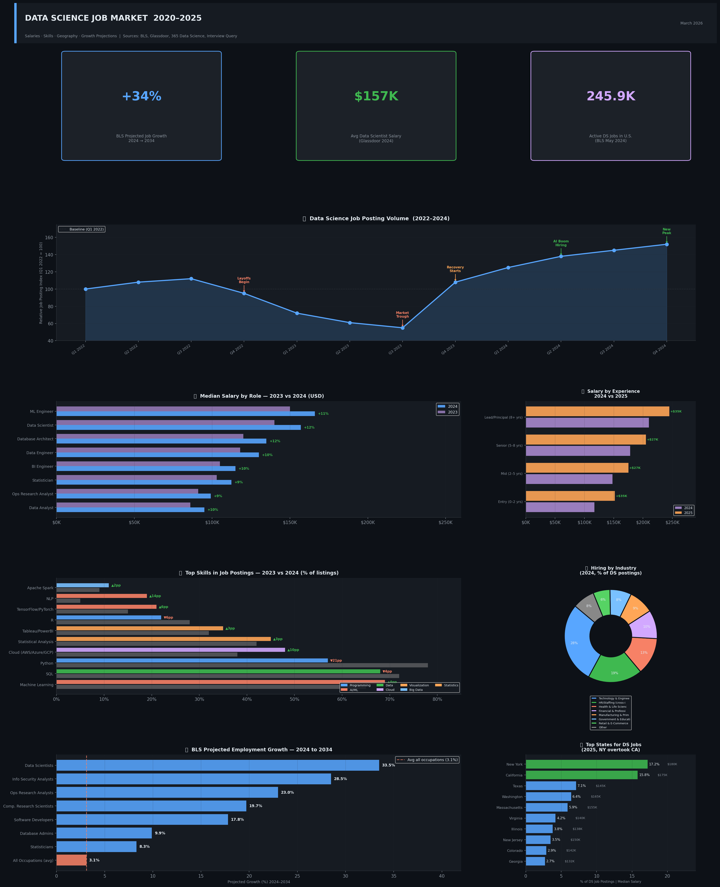
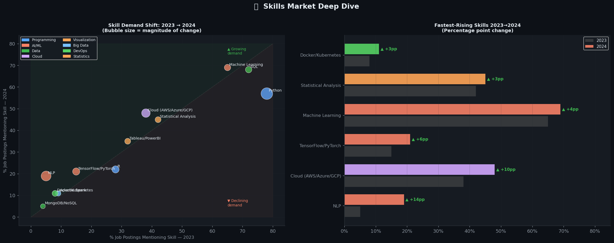

# 📊 Data Science Job Market Analysis (2022–2025)

> A visual data project exploring salaries, skills demand, geographic trends, and employment growth projections in the data science field — built as a portfolio piece for data analyst/scientist roles.

---

## 🖼 Preview




---

## 📁 Project Structure

```
data_science_job_market/
├── data_science_job_market_analysis.ipynb  ← Main Jupyter Notebook (full analysis)
├── outputs/
│   ├── visual_report.png                   ← 7-panel infographic report
│   ├── skills_analysis.png                 ← Skills demand deep dive
│   ├── data_science_jobs_2024_clean.csv    ← Clean static dataset (15 cols, 0 dupes)
└── README.md
```

---

## 📋 Deliverables

### 1. Visual Report (`outputs/visual_report.png`)
A 7-panel infographic-style report covering:
- **Job Posting Volume Index** (2022–2024) — tracking the layoff trough and AI-boom recovery
- **Median Salary by Role** — 2023 vs 2024 comparison with YoY growth %
- **Salary by Experience Level** — 2024 vs 2025 with $K delta labels
- **In-Demand Skills** — % of postings mentioning each skill, with YoY change
- **Hiring by Industry** — donut chart of DS job share by sector
- **BLS Employment Growth Projections** — 2024–2034, benchmarked vs avg
- **Top States for DS Jobs** — with median salary overlay

### 2. Static Dataset (`outputs/data_science_jobs_2024_clean.csv`)
A clean, deduplicated, normalized dataset with:
- 8 roles × 15 columns
- All salaries normalized to USD integers
- Salary percentiles (p10, median, p90) per role
- Source and methodology tags per record
- Validation checks embedded in notebook (assertions, null audits)

---

## 📊 Key Findings

- **Data Scientists** are the **4th fastest-growing U.S. occupation** (BLS 2024–2034): +33.5%
- Job postings **surged ~96%** from early to end of 2023 after the layoff trough
- **NLP demand** jumped from 5% → 19% of postings year-over-year (+14pp) — biggest rise
- **New York** overtook California as the #1 state for DS job postings in 2025
- **Entry-level salaries** jumped $35K in one year: $117K (2024) → $152K (2025)

---

## 🛠 Tech Stack

| Tool | Purpose |
|---|---|
| Python 3.11 | Core language |
| Pandas | Data wrangling, cleaning, normalization |
| NumPy | Numerical operations |
| Matplotlib | All visualizations (dark editorial theme) |
| Jupyter Notebook | Interactive analysis environment |

---

## 📦 Data Sources

| Source | Data Used |
|---|---|
| [U.S. Bureau of Labor Statistics (BLS)](https://www.bls.gov/ooh/math/data-scientists.htm) | Employment counts, salary percentiles, growth projections 2024–2034 |
| [BLS OEWS Table 1 (May 2024)](https://www.bls.gov/news.release/ocwage.t01.htm) | Precise occupation employment & wage data |
| [Glassdoor Salary Reports](https://www.glassdoor.com) | Average salaries by role and experience level |
| [365 Data Science — Job Market 2024 & 2025](https://365datascience.com) | Skills demand, geographic distribution, degree requirements |
| [Interview Query — 2024 DS Report](https://www.interviewquery.com/p/the-2024-data-science-report) | Job posting index, interview trend analysis |

---

## ▶ How to Run

```bash
# Clone the repo
git clone https://github.com/aderajewYeshiwendm/data-science-job-market.git
cd data-science-job-market

# Install dependencies
pip install jupyter pandas numpy matplotlib

# Launch the notebook
jupyter notebook data_science_job_market_analysis.ipynb
```


---

## 🔎 Data Quality Notes

All data was sourced from primary references (BLS, Glassdoor) rather than aggregators. 

---

*Built March 2025 | Data as of 2024 Q4 / 2025 Q1*